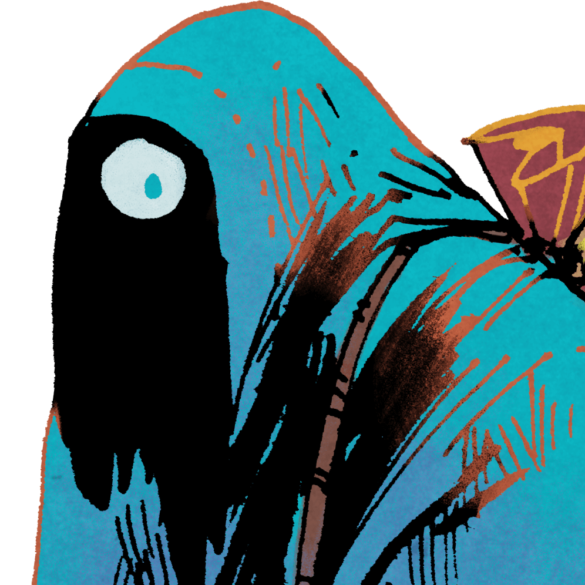

## Game State

<span id="oath"/>

### Dramatis Personæ

|  |  |
| **Chancellor**:<br/>Alex                                                   | **Black**:<br/>Viktor (Exile)                                          |
|       |  |
| **Blue**:<br/>Kristín (Exile)                                              | **Yellow**:<br/> Andreas (Exile)                                       |

### The World

#### Sites in play

_Cradle_
<span id="site1"/>
<span id="site2"/>

_Provinces_
<span id="site3"/>
<span id="site4"/>
<span id="site5"/>

_Hinterlands_
<span id="site6"/>
<span id="site7"/>
<span id="site8"/>

#### World Deck

| Suit                           | Number                                                               |
|--------------------------------|----------------------------------------------------------------------|
| <span class="number"/> Discord | <span class="counter" data-imgsrc="assets/images/suit-discord.png"/> |
| <span class="number"/> Hearth  | <span class="counter" data-imgsrc="assets/images/suit-hearth.png"/>  |
| <span class="number"/> Nomad   | <span class="counter" data-imgsrc="assets/images/suit-nomad.png"/>   |
| <span class="number"/> Arcane  | <span class="counter" data-imgsrc="assets/images/suit-arcane.png"/>  |
| <span class="number"/> Order   | <span class="counter" data-imgsrc="assets/images/suit-order.png"/>   |
| <span class="number"/> Beast   | <span class="counter" data-imgsrc="assets/images/suit-beast.png"/>   |

#### TTS Chronicle
```
030303000219The Helichrysum Chronicle2B010101234505FFFFFF20FFFFFF14FFFFDE1BFFFFFF29FFFFFF16FFFFE01EFFFFFF1FFFFFFF3B0624182B0E2629D61ED31D15D51309522F201C3521001FD2D42819C30B1632AD0F342233C125089810010D112C121A0507042314270AB717312D30062A1B2E0C030212E9DBDCEAE8E7E4DFDADDEDE2E6ECE3E5E1EB000105ARman
```

## The Helichrysum Chronicle

### First Era of The People, <br/> Reign of Alex I
As a new day dawned, the woman left her hovel to gather water at the River. While the morning dew slowly evaporated in the sun, rising with the promise of a beautiful day, she spotted a small host of warbands arriving under the Imperial banner, along with many camp followers carrying the unmistakable look of refugees from the War of the Four Houses. A figure wearing the ceremonial mask of the Chancellor clambered unto a cliff and spoke. "Today we start anew. From this rock, a new Empire will rise, not from violence, but from the hearts of each and every one of you, my loyal subjects! Such is my oath."

The woman hesitates, enjoying the warming rays of the sun, and starts on her path home with a filled jug balancing atop her head.


### First Era of Supremacy, <br/> Reign of Viktor I

Excerpt from _Baptism of Fire: A Treatise on the Four Houses during the Reign of Viktor I_:

Among the commonfolk, it was said that a new era had begun. Omens had been taken, warning of a time of turmoil and conflict.
The great chancellor Viktor I had sworn to expand the realm with fire and sword. At this time he securely held the known lands and has amassed a strong army across the mountains.
Meanwhile, however, the exiled Alex of House Red had been working with the land's greatest alchemist to amass a large fortune. This, of course, would turn out most auspiciously for his ill-favored house. The exiled Kristín of House Blue was uncovering the secrets of the land and unearthing forgotten relics.
But Andreas of the House Yellow was no longer content in his exile, and rose from the Hinterlands with a mighty army. It has been speculated that such expeditious mustering could only have been done with the help of dark magic. The frenzied commander struck and seized control from the Rightful Chancellor, ushering in a time of great dispair!
Facing such foul opposition, Chancellor Viktor I, in his great wisdom, called upon the prosperous House Red, and in exchange for favor and devotion, he passed along administrative control over the empire.

As their first official action, House Red declared themselves lawful citizens of the Empire, and donned the fabled Ring of Devotion to and campaign retake lost lands.
In the face of this just force, the devious Exiles banded together to overthrow what they understood as oppressive control of the empire.
Battle lines were drawn, and the land was trapped in the cycles of warfare.
Power passed back and forth, and destruction spread across the land. Soldiers and denizens were killed alike by warfare and long-forgotten terrors. Heretical visions were declared by House Blue, visions of an Empire of sorcery and venerance of ancient relics.

But calling upon the wild forces of the land, the Empire grew too powerful: the ancient ways of nature outgrew the decadent ways of the exiles, and the flourishing economy combined with the vast supply of the empire proved too much for the Exiles to resist.
In the final stages of the war, the combined efforts of Chancellor Viktor and Upstanding Citizen Alex annihilated the occupying forces, and victory for the empire was certain, though the war-ravaged lands were left to be pillaged by bandits and outlaws.
In a final act of cunning, the Great Successor Alex seized hold of the empire's armies and captured the favor of the people, thus ending the crumbling reign of Viktor I with consolidated military strength and popular support.
But in the chaos, the bloodthirsty and spiteful House Yellow made a desperate and cowardly attack on the final stronghold of the Empire, toppling their rule and casting the land into disarray.
Much doubt was cast on the future of the Empire that the mighty House Red inherited...


### The Dawn of History
In the dimly lit room of his stronghold, a glint of dawn peeking through the window, the chancellor hesitates a moment, then presses his seal against the molten wax.
He leans back with a sigh.
"It is done, then.
Let these three great houses rot in exile, and let there be peace once more.
However brief it may be."
