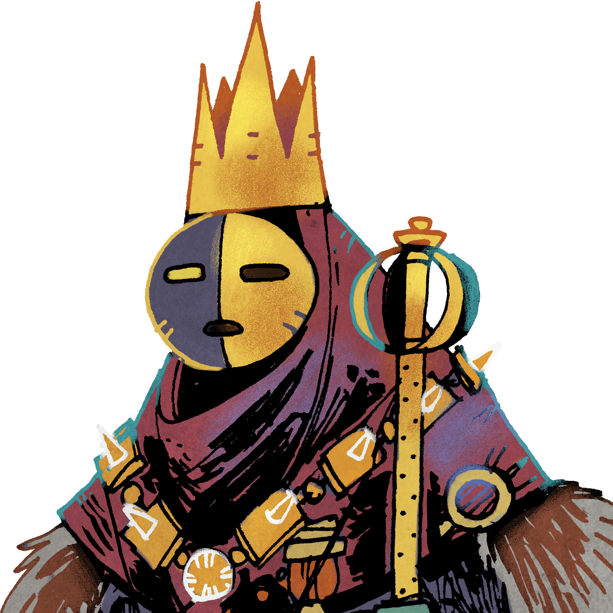
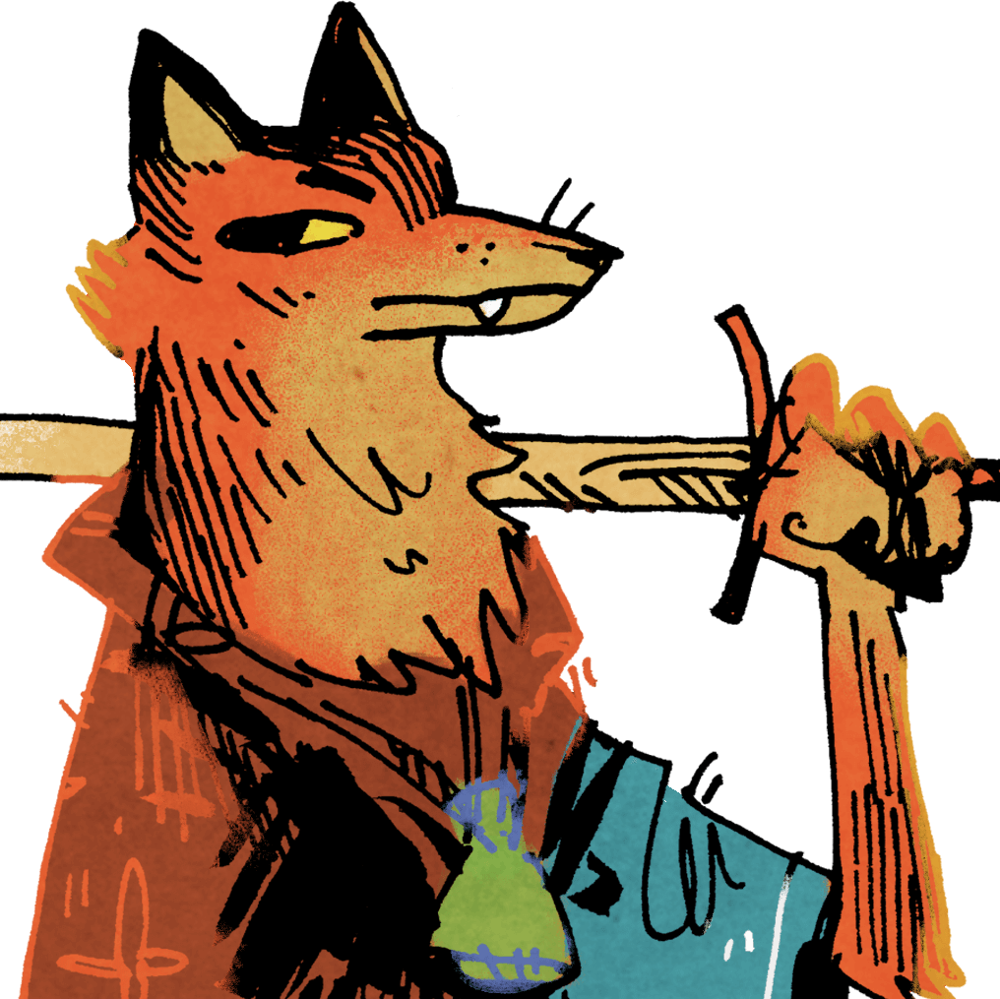
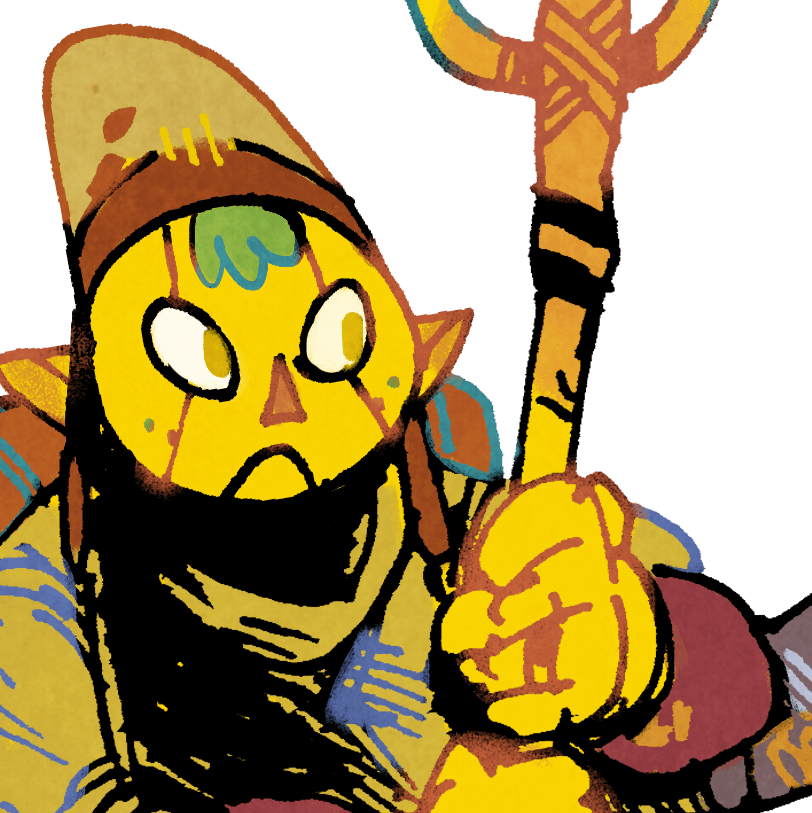

# Fredskonference

Dette er en kladde!

[Tilbage](https://abmichelsen.com/oath-chronicle/)

### [Stem her!](https://docs.google.com/forms/d/e/1FAIpQLSeVmSODa6ZD3D5SQmIOIBSDgSmJWa7Y68W2Lu00MeQj6mo-3g/viewform?usp=sf_link)

**Oath reference**
- Supremacy: Rule the most sites
- The People: Hold the People's Favor
- Protection: Hold the most relics and banners
- Devotion: Hold the Darkest Secret

<!-- Oath storage:
  Oath _of_ Supremacy

  Oath _of_ The People

  Oath _of_ Devotion

  Oath _of_ Sanctuary
-->

## Rigskansleren

  Oath _of_ Devotion

**Sites**:
- Plains (Key to the City, Storyteller)
- Lush Coast (Forest Paths, Mercenaries, Wrestlers)
- Mountain (Taming Charm)
- Buried Giant

**World deck**:

+3 , +2 , +1 .

Må desuden bygge et _bygningsværk_.

## Il Duce

  Oath _of_ Sanctuary

**Sites**:

**World deck**:
  
+3 , +2 , +1 .

## El Bastardo

  Oath _of_ The People

**Sites**:

**World deck**:

+3 , +2 , +1 .

## Vox Populi

  Oath _of_ The People

**Sites**:
- Rocky Coast (Elders, The Old Oak)
- Wastes (Book Burning)
- Great Slum

**World deck**:
  
+3 , +2 , +1 .
