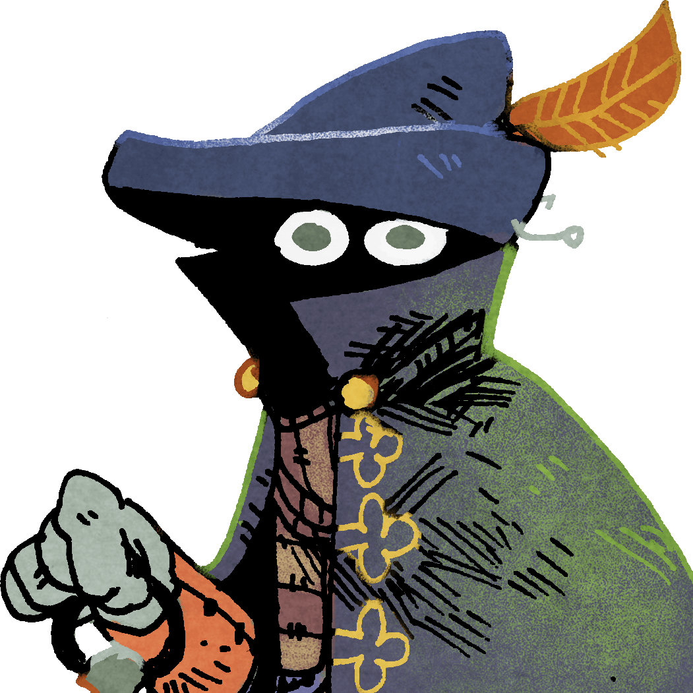

## Game State

**Current oath:**

  Oath _of_ Supremacy

<!-- Oath storage:
  Oath _of_ The People

  Oath _of_ Devotion

  Oath _of_ Protection
-->

### Dramatis Personæ

||||
|---|---|---|
|**The Chancellor**:  Alexander| **Il Duce, Citizen**:  Andreas |**El Bastardo, Exile**:  Alik|
| | | |
||||
|**Vox Populi, Exile**:  Kasper|**???**|**???**|

### The World

**Sites in play:** 
- Plains (Longbows)
- Mountains (Taming Charm)
- Rocky Coast (Elders)

**World Deck:** 

|Suit|Number|
|---|---|
|9 Discord| |
|9 Arcane| |
|9 Order| |
|9 Hearth| |
|9 Beast| |
|9 Nomad| |

[Download TTS file](tts-file)

## Krønike

###  Femte Æra i Folkets tegn,   Kasper IV's herredømme
Femte "The people" spil, fjerde gang Kasper er rigskansler

### Første Æra i Overmagtens tegn,   Alexander I's herredømme
Første "Supremacy" spil, første gang Alexander er rigskansler

### Introduktion
Mens det dystre kammer i hjertet af hans fæstning rammes af daggryets første stråler, trykker Rigskansleren sin signetring mod den bløde voks. Han læner sig tilbage med et suk. "Lad det ske. Lad disse tre mægtige slægter rådne i eksil, og lad freden igen sænke sig over riget. Hvor kort den end bliver."

En velklædt herre bærende hovedstadens lilla banner træder omkranset af soldater ind i bymidten og op på podiet. Manden rømmer sig og skråler med en skinger, men gennemtrængende stemme:

"Borgere af provinsen, Rigskansleren bringer nyt fra hovedstaden. Den royale slægt er død. Dette markerer slutningen på arvekrigene. Kejserens loyale tjener, rigskansler Alexander I udnævnes som regent af riget.

Han har sværget en ed ved tro og lov at holde kejserens rige samlet, så ingen falsk konge, ingen hedensk tro, ingen tyvagtige oprørere skal adskille jer, imperiets borgere, fra jeres ret og forbindelse til hovedstaden. Kejserens dynasti er død, mens hans eftermæle og arv lever videre.

Længe leve rigskansleren!"

<!--
In the dimly lit room of his stronghold, a glint of dawn peeking through the window, the chancellor hesitates a moment, then presses his seal against the molten wax. He leans back with a sigh. "It is done, then. Let these three great houses rot in exile, and let there be peace once more. However brief it may be."
-->
